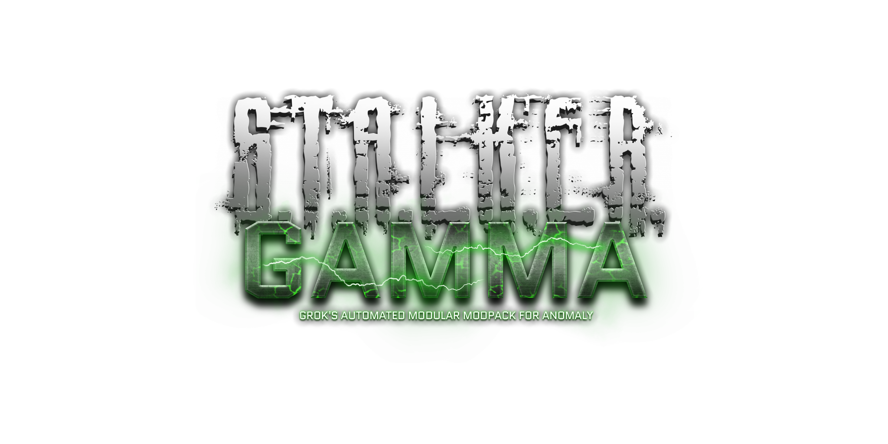

<h1 align="center">
   
  
   
  S.T.A.L.K.E.R G.A.M.M.A RU Translations
   
</h1>

<h4 align="center">Translations & text improvements of G.A.M.M.A modifications to enhance gameplay experience.</h4>

  <a href="https://github.com/0u73r-h34v3n/STALKER-GAMMA-Russian-Translation/tree/release">Release</a> •
  <a href="https://github.com/0u73r-h34v3n/STALKER-GAMMA-Russian-Translation/blob/master/CHANGELOG.md">Changelog</a>

## Instalation
1. Download `.zip` file from [release page](https://github.com/0u73r-h34v3n/STALKER-GAMMA-Russian-Translation/releases).
2. Go to `G.A.M.M.A` folder of your game
3. **Create a backup of `/mods` folder**
4. Open `/mods` folder
5. Move all folders extracted from `.zip` into `/mods` folder

## Credits
- **Dr.Pr1nkos** for initial translations of GMTOP files
- **SaloEater** for help with translations & GAMMA scripts modifications

## License

MIT

